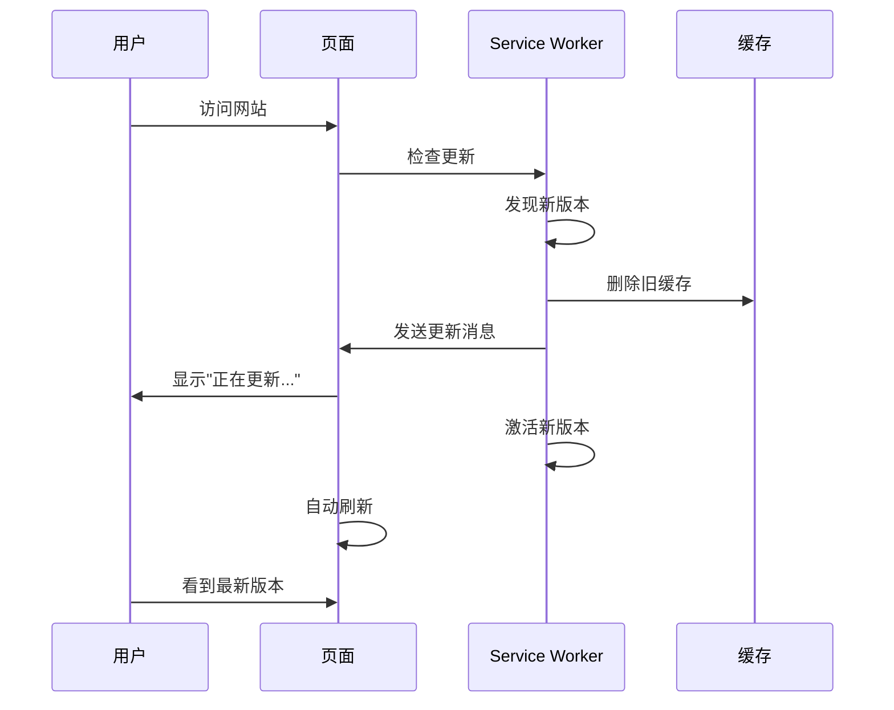

# 版本更新指南

## 自动缓存清理机制

当发布新版本时，Service Worker 会自动清理旧缓存并提示用户更新。

## 工作流程



## 更新步骤

### 1. 修改版本号

**更新 Service Worker 版本**：
```javascript
// public/sw.js
const CACHE_NAME = 'weiz-nav-v4';  // v3 → v4
const RUNTIME_CACHE = 'weiz-nav-runtime-v4';
const IMAGE_CACHE = 'weiz-nav-images-v4';
```

**更新版本信息**：
```json
// public/version.json
{
  "version": "1.0.4",
  "buildTime": "2024-11-18T12:00:00.000Z",
  "cacheVersion": "v4",
  "changelog": [
    "新功能描述",
    "Bug 修复",
    "性能优化"
  ]
}
```

### 2. 提交和部署

```bash
# 提交更改
git add public/sw.js public/version.json
git commit -m "chore: 发布 v1.0.4"
git push

# Cloudflare Pages 自动部署
```

### 3. 用户体验

**用户访问网站时**：
1. Service Worker 检测到新版本
2. 后台下载新的 Service Worker
3. 显示提示："发现新版本，正在更新..."
4. 自动删除旧缓存
5. 激活新版本
6. 自动刷新页面
7. 显示："应用已更新到最新版本！"

**整个过程约 2-3 秒，用户几乎无感知**

## 缓存清理策略

### 自动清理

Service Worker 激活时会自动清理：
```javascript
// 保留当前版本的缓存
const keepCaches = [CACHE_NAME, RUNTIME_CACHE, IMAGE_CACHE];

// 删除所有其他缓存
caches.keys().then((cacheNames) => {
  cacheNames.forEach((cacheName) => {
    if (!keepCaches.includes(cacheName)) {
      caches.delete(cacheName);  // 删除旧缓存
    }
  });
});
```

### 清理的内容

1. **旧版本的静态资源缓存**
2. **旧版本的运行时缓存**
3. **旧版本的图片缓存**

### 保留的内容

1. **LocalStorage 数据**（用户的导航链接）
2. **用户设置**（主题、搜索引擎等）
3. **当前版本的缓存**

## 版本检查机制

### 定期检查

```javascript
// 每小时检查一次更新
setInterval(() => {
  registration.update();
}, 60 * 60 * 1000);
```

### 手动检查

用户可以通过以下方式手动检查更新：
1. 刷新页面（F5）
2. 硬刷新（Ctrl+Shift+R）
3. 清除缓存后刷新

## 版本回滚

如果新版本有问题，可以快速回滚：

### 1. 回滚代码

```bash
# 回滚到上一个版本
git revert HEAD
git push
```

### 2. 用户端清理

用户需要：
1. 清除浏览器缓存
2. 刷新页面
3. 或等待 Service Worker 自动更新

## 测试更新流程

### 本地测试

```bash
# 1. 构建当前版本
pnpm build
pnpm serve:static

# 2. 访问 http://localhost:3000
# 3. 打开 DevTools → Application → Service Workers

# 4. 修改版本号（v3 → v4）
# 5. 重新构建
pnpm build

# 6. 刷新页面
# 7. 观察 Service Worker 更新过程
```

### 生产测试

```bash
# 1. 部署到测试环境
git push origin test

# 2. 访问测试网站
# 3. 观察更新提示
# 4. 确认缓存已清理
# 5. 验证功能正常

# 6. 部署到生产环境
git push origin main
```

## 监控更新状态

### 浏览器控制台

```javascript
// 查看当前 Service Worker 版本
navigator.serviceWorker.getRegistration().then((reg) => {
  console.log('当前版本:', reg.active?.scriptURL);
});

// 查看所有缓存
caches.keys().then((keys) => {
  console.log('缓存列表:', keys);
});

// 查看缓存大小
navigator.storage.estimate().then((estimate) => {
  console.log('已使用:', estimate.usage, 'bytes');
  console.log('配额:', estimate.quota, 'bytes');
});
```

### Service Worker 状态

```
DevTools → Application → Service Workers

状态说明：
- installing: 正在安装
- installed: 已安装，等待激活
- activating: 正在激活
- activated: 已激活，正在运行
- redundant: 已废弃
```

## 常见问题

### Q: 用户会丢失数据吗？

**A**: 不会！
- LocalStorage 数据不会被清理
- 只清理缓存的静态资源
- 用户的导航链接、设置都会保留

### Q: 更新需要多长时间？

**A**: 通常 2-3 秒
- 下载新 Service Worker: ~1 秒
- 清理旧缓存: ~0.5 秒
- 刷新页面: ~0.5 秒

### Q: 用户必须刷新页面吗？

**A**: 会自动刷新
- Service Worker 激活后自动刷新
- 用户无需手动操作
- 显示友好的更新提示

### Q: 如果用户不在线怎么办？

**A**: 下次在线时更新
- Service Worker 会在后台等待
- 用户下次访问时检查更新
- 离线期间使用旧版本

### Q: 可以强制用户更新吗？

**A**: 可以，但不推荐
```javascript
// 强制刷新（不推荐）
if (newWorker.state === 'installed') {
  newWorker.postMessage({ type: 'SKIP_WAITING' });
  window.location.reload();  // 立即刷新
}
```

推荐使用当前的友好提示方式。

## 版本命名规范

### 语义化版本

```
v主版本.次版本.修订版本

例如：v1.2.3
- 主版本：重大更新，可能不兼容
- 次版本：新功能，向后兼容
- 修订版本：Bug 修复，向后兼容
```

### 缓存版本

```
weiz-nav-v{number}

例如：weiz-nav-v3
- 每次更新递增
- 简单明了
- 易于识别
```

## 最佳实践

### 1. 版本号管理

- ✅ 使用语义化版本
- ✅ 在 version.json 中记录
- ✅ 在 CHANGELOG.md 中记录
- ✅ Git tag 标记版本

### 2. 测试流程

- ✅ 本地测试更新流程
- ✅ 测试环境验证
- ✅ 生产环境灰度发布
- ✅ 监控错误日志

### 3. 用户体验

- ✅ 友好的更新提示
- ✅ 自动刷新页面
- ✅ 保留用户数据
- ✅ 快速更新过程

### 4. 回滚准备

- ✅ 保留上一个版本的代码
- ✅ 准备回滚脚本
- ✅ 监控用户反馈
- ✅ 快速响应问题

## 更新检查清单

发布新版本前，确认：

- [ ] 更新 Service Worker 版本号
- [ ] 更新 version.json
- [ ] 更新 CHANGELOG.md
- [ ] 本地测试更新流程
- [ ] 测试环境验证
- [ ] 代码审查通过
- [ ] 准备回滚方案
- [ ] 通知用户（如果是重大更新）

## 示例：发布 v1.0.4

```bash
# 1. 更新版本号
# 编辑 public/sw.js
const CACHE_NAME = 'weiz-nav-v4';

# 编辑 public/version.json
{
  "version": "1.0.4",
  "cacheVersion": "v4"
}

# 2. 提交
git add .
git commit -m "chore: 发布 v1.0.4

- 新增功能 A
- 修复 Bug B
- 优化性能 C"

# 3. 打标签
git tag v1.0.4
git push origin v1.0.4

# 4. 部署
git push origin main

# 5. 监控
# 查看 Cloudflare Pages 部署日志
# 监控用户反馈
# 检查错误日志
```

## 总结

✅ **自动化**：版本更新完全自动化
✅ **无感知**：用户几乎无感知更新
✅ **安全**：保留用户数据
✅ **快速**：2-3 秒完成更新
✅ **可靠**：自动清理旧缓存

---

**享受无缝的版本更新体验！** 🚀
