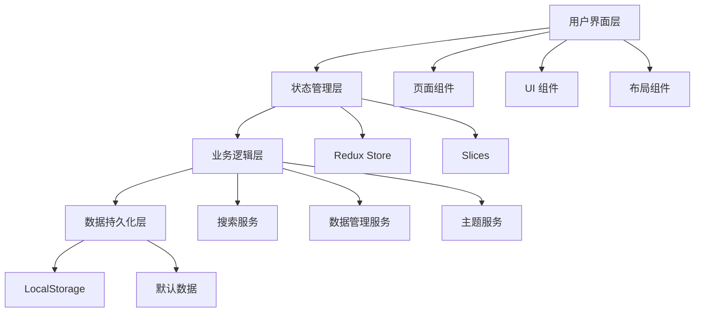
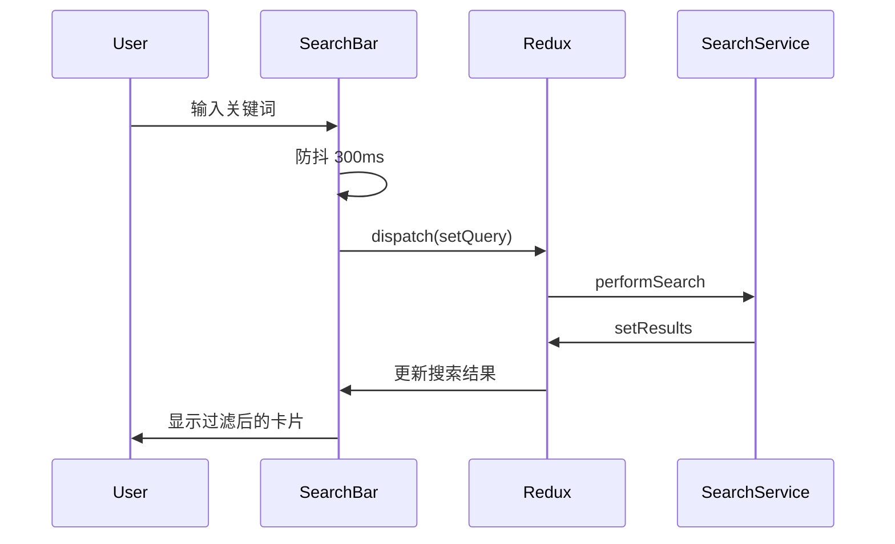

# 设计文档

## 概述

本文档描述了现代化个人前端导航网站的技术架构和设计方案。该网站基于 Next.js 15 App Router 构建，采用 TypeScript、Tailwind CSS、Ant Design 5.x 和 Redux Toolkit 等现代技术栈，实现响应式、高性能的用户体验。

### 技术栈

- **框架**: Next.js 15.x (App Router)
- **语言**: TypeScript 5.x
- **样式**: Tailwind CSS 4.x
- **UI 组件库**: Ant Design (antd) 5.x
- **图标**: @ant-design/icons
- **动画库**: framer-motion (替代 React Bits，更成熟稳定)
- **状态管理**: Redux Toolkit 2.x
- **数据持久化**: LocalStorage API
- **包管理器**: pnpm 10.x
- **Node 版本**: v20.x

## 架构设计

### 整体架构



### 目录结构

```
frontend-navigation-site/
├── src/
│   ├── api/                      # api接口
│   │   └── favicon.ts            # 网站图标接入 Favicon.im 的 api
│   ├── app/                      # Next.js App Router
│   │   ├── layout.tsx           # 根布局
│   │   ├── page.tsx             # 主页
│   │   ├── manage/              # 数据管理页面
│   │   │   └── page.tsx
│   │   └── globals.css          # 全局样式
│   ├── components/              # React 组件
│   │   ├── layout/
│   │   │   ├── Header.tsx       # 页头组件
│   │   │   ├── SearchBar.tsx    # 搜索栏
│   │   │   └── ThemeToggle.tsx  # 主题切换
│   │   ├── navigation/
│   │   │   ├── LinkCard.tsx     # 链接卡片
│   │   │   ├── LinkGrid.tsx     # 卡片网格
│   │   │   └── ContextMenu.tsx  # 右键菜单
│   │   ├── modals/
│   │   │   ├── EditLinkModal.tsx    # 编辑链接弹窗
│   │   │   └── ConfirmModal.tsx     # 确认弹窗
│   │   └── management/
│   │       ├── DataTable.tsx        # 数据表格
│   │       └── ImportExport.tsx     # 导入导出
│   ├── store/                   # Redux 状态管理
│   │   ├── index.ts            # Store 配置
│   │   ├── slices/
│   │   │   ├── linksSlice.ts   # 链接数据
│   │   │   ├── searchSlice.ts  # 搜索状态
│   │   │   └── settingsSlice.ts # 设置（主题、搜索引擎）
│   │   └── hooks.ts            # 类型化的 hooks
│   ├── services/               # 业务逻辑服务
│   │   ├── storage.ts         # LocalStorage 封装
│   │   ├── search.ts          # 搜索逻辑
│   │   └── defaultData.ts     # 默认数据
│   ├── types/                 # TypeScript 类型定义
│   │   ├── link.ts
│   │   ├── search.ts
│   │   └── settings.ts
│   └── utils/                 # 工具函数
│       ├── debounce.ts
│       └── colorUtils.ts
├── public/                    # 静态资源
│   └── icons/                # 自定义图标
├── tailwind.config.ts        # Tailwind 配置
├── next.config.js            # Next.js 配置
├── tsconfig.json             # TypeScript 配置
└── package.json
```

## 核心组件设计

### 1. 数据模型

#### Link（导航链接）

```typescript
interface Link {
  id: string;                    // 唯一标识符
  name: string;                  // 链接名称
  url: string;                   // 链接地址
  description: string;           // 描述
  icon?: string;                 // 图标 URL 或 Ant Design 图标名称
  backgroundColor?: string;      // 背景颜色（HEX 格式）
  category?: string;             // 分类
  tags?: string[];              // 标签
  order: number;                // 排序序号
  createdAt: number;            // 创建时间戳
  updatedAt: number;            // 更新时间戳
}
```

#### SearchEngine（搜索引擎）

```typescript
interface SearchEngine {
  id: string;                    // 唯一标识符
  name: string;                  // 搜索引擎名称
  icon: string;                  // 图标（Ant Design 图标名称或 URL）
  searchUrl: string;             // 搜索 URL 模板（{query} 占位符）
}
```

#### Settings（用户设置）

```typescript
interface Settings {
  theme: 'light' | 'dark' | 'system';  // 主题模式
  searchEngine: string;                 // 当前搜索引擎 ID
  layout: 'grid' | 'list';             // 布局模式
}
```

### 2. 状态管理设计

#### Redux Store 结构

```typescript
interface RootState {
  links: {
    items: Link[];              // 所有链接
    loading: boolean;           // 加载状态
    error: string | null;       // 错误信息
  };
  search: {
    query: string;              // 搜索关键词
    results: Link[];            // 搜索结果
    isSearching: boolean;       // 搜索状态
  };
  settings: {
    theme: 'light' | 'dark' | 'system';
    searchEngine: string;
    layout: 'grid' | 'list';
  };
}
```

#### Slices 设计

**linksSlice**
- Actions: `addLink`, `updateLink`, `deleteLink`, `reorderLinks`, `loadLinks`, `resetLinks`
- Thunks: `loadLinksFromStorage`, `saveLinksToStorage`

**searchSlice**
- Actions: `setQuery`, `setResults`, `clearSearch`
- Thunks: `performSearch` (带防抖)

**settingsSlice**
- Actions: `setTheme`, `setSearchEngine`, `setLayout`
- Thunks: `loadSettings`, `saveSettings`

### 3. 页面组件设计

#### 主页 (app/page.tsx)

**布局结构:**
```
┌───────────────────────────────────┐
│     Header (索栏 + 主题切换)        │
├───────────────────────────────────┤
│               ┌───────┐           │
│               │(搜索框)│           │
│               └───────┘           │
│ │分类│                             │
│ │   │  LinkGrid (响应式卡片网格)     │
│ │主页│  ┌────┐ ┌────┐ ┌────┐ ┌────┐│
│ │   │  │Card│ │Card│ │Card│ │Card│ │
│ │工作│  └────┘ └────┘ └────┘ └────┘ │
│ │   │  ┌────┐ ┌────┐ ┌────┐ ┌────┐ │
│ │娱乐│  │Card│ │Card│ │Card│ │Card│ │
│ │   │  └────┘ └────┘ └────┘ └────┘ │
│     │                              │
│     │      [+ 添加链接]             │
│     │                             │
└───────────────────────────────────┘
```

**响应式断点:**
- Desktop (≥1280px): 6 列
- Laptop (1024px-1279px): 4 列
- Tablet (768px-1023px): 3 列
- Mobile (640px-767px): 2 列
- Small Mobile (<640px): 1 列

#### 数据管理页面 (app/manage/page.tsx)

**功能区域:**
- 顶部工具栏：导入/导出、批量删除、重置数据
- 数据表格：可拖拽排序、行内编辑
- 操作列：编辑、删除按钮

### 4. 关键组件详细设计

#### SearchBar 组件

**功能:**
- 搜索引擎切换下拉菜单
- 实时搜索输入（300ms 防抖）
- 回车键触发外部搜索
- 清除搜索按钮

**状态:**
- 本地状态：输入值、下拉菜单显示
- Redux 状态：搜索引擎选择、搜索结果

**交互流程:**


#### LinkCard 组件

**视觉设计:**
- 卡片尺寸：固定高度 120px，宽度自适应
- 图标：48x48px，居中显示
- 背景：支持自定义颜色或渐变
- 悬停效果：轻微上浮 + 阴影增强
- 动画：使用 framer-motion 实现

**图标加载策略（多级回退机制）:**
1. **第一级：自定义图标**
   - 如果用户提供了自定义图标 URL，优先加载
   - 使用 `` 标签的 `onError` 事件监听加载失败
   - 设置 `loading="lazy"` 和 `decoding="async"` 优化性能

2. **第二级：Favicon 回退**
   - 当自定义图标加载失败时，自动尝试加载网站的 favicon
   - 使用 `getFaviconUrl()` 函数获取 favicon URL
   - 同样监听 `onError` 事件处理加载失败

3. **第三级：默认图标**
   - 当所有图片加载都失败时，显示 Ant Design 的 `LinkOutlined` 图标
   - 确保默认图标大小与自定义图标保持一致
   - 使用 `iconScale` 属性控制图标缩放

**图标加载实现细节:**
- 使用 React state 跟踪加载状态（`hasError`, `faviconError`, `imageLoaded`, `faviconLoaded`）
- 通过 CSS `display` 属性控制图标显示/隐藏，避免显示破损图片
- 在控制台记录加载失败的警告信息，便于调试
- 使用 `onLoad` 事件标记图片成功加载，防止误判

**IconWithFallback 子组件:**
```typescript
interface IconWithFallbackProps {
  src: string;           // 主图标 URL
  alt: string;           // 图标描述
  fallbackUrl?: string;  // 回退 favicon URL
  scale?: number;        // 图标缩放比例（默认 0.8）
}
```

**右键菜单:**
- 使用 Ant Design Dropdown 组件
- 菜单项：编辑、删除
- 阻止默认浏览器右键菜单

**Props:**
```typescript
interface LinkCardProps {
  link: Link;
  onEdit: (link: Link) => void;
  onDelete: (id: string) => void;
}
```

#### EditLinkModal 组件

**表单字段:**
1. 地址 (URL) - 必填，URL 格式验证
2. 名称 - 必填，最大 50 字符
3. 描述 - 可选，最大 200 字符
4. 图标 - 可选，支持 URL 或选择预设图标
5. 背景颜色 - 颜色选择器，支持预设颜色和自定义 HEX

**验证规则:**
- URL 格式验证
- 名称不能为空
- 颜色必须是有效的 HEX 格式

**使用 Ant Design Form 组件:**
- Form.Item 包裹每个字段
- 使用 rules 属性定义验证规则
- 提交时触发 onFinish 回调

### 5. 搜索功能设计

#### 搜索算法

**匹配策略:**
1. 精确匹配：关键词完全匹配名称或 URL
2. 模糊匹配：关键词部分匹配名称、描述或标签
3. 拼音匹配（可选）：支持中文拼音搜索

**实现方案:**
```typescript
function searchLinks(links: Link[], query: string): Link[] {
  const lowerQuery = query.toLowerCase().trim();
  
  if (!lowerQuery) return links;
  
  return links.filter(link => {
    const nameMatch = link.name.toLowerCase().includes(lowerQuery);
    const descMatch = link.description.toLowerCase().includes(lowerQuery);
    const urlMatch = link.url.toLowerCase().includes(lowerQuery);
    const tagMatch = link.tags?.some(tag => 
      tag.toLowerCase().includes(lowerQuery)
    );
    
    return nameMatch || descMatch || urlMatch || tagMatch;
  });
}
```

**性能优化:**
- 使用 debounce 防抖（300ms）
- 搜索结果缓存
- 虚拟滚动（如果链接数量 > 100）

#### 搜索引擎集成

**预设搜索引擎:**
```typescript
const SEARCH_ENGINES: SearchEngine[] = [
  {
    id: 'google',
    name: 'Google',
    icon: 'GoogleOutlined',
    searchUrl: 'https://www.google.com/search?q={query}'
  },
  {
    id: 'bing',
    name: 'Bing',
    icon: 'SearchOutlined',
    searchUrl: 'https://www.bing.com/search?q={query}'
  },
  {
    id: 'baidu',
    name: 'Baidu',
    icon: 'SearchOutlined',
    searchUrl: 'https://www.baidu.com/s?wd={query}'
  },
  // ... 其他搜索引擎
];
```

### 6. 主题系统设计

#### 主题实现方案

**使用 Next.js + Tailwind CSS Dark Mode:**
- 利用 Tailwind 的 `dark:` 前缀
- 使用 `next-themes` 库管理主题状态
- 支持系统主题自动切换

**配置 tailwind.config.ts:**
```typescript
module.exports = {
  darkMode: 'class',
  theme: {
    extend: {
      colors: {
        // 自定义主题颜色
      }
    }
  }
}
```

**主题切换动画:**
- 使用 CSS transitions 实现平滑过渡
- 过渡时间：300ms
- 过渡属性：background-color, color, border-color

#### Ant Design 主题配置

**使用 ConfigProvider 全局配置:**
```typescript
<ConfigProvider
  theme={{
    algorithm: theme === 'dark' ? darkAlgorithm : defaultAlgorithm,
    token: {
      colorPrimary: '#1890ff',
      borderRadius: 8,
    }
  }}
>
  {children}
</ConfigProvider>
```

### 7. 数据持久化设计

#### LocalStorage 封装

**Storage Service:**
```typescript
class StorageService {
  private readonly KEYS = {
    LINKS: 'nav_links',
    SETTINGS: 'nav_settings',
  };

  saveLinks(links: Link[]): void {
    localStorage.setItem(this.KEYS.LINKS, JSON.stringify(links));
  }

  loadLinks(): Link[] | null {
    const data = localStorage.getItem(this.KEYS.LINKS);
    return data ? JSON.parse(data) : null;
  }

  saveSettings(settings: Settings): void {
    localStorage.setItem(this.KEYS.SETTINGS, JSON.stringify(settings));
  }

  loadSettings(): Settings | null {
    const data = localStorage.getItem(this.KEYS.SETTINGS);
    return data ? JSON.parse(data) : null;
  }

  clear(): void {
    localStorage.removeItem(this.KEYS.LINKS);
    localStorage.removeItem(this.KEYS.SETTINGS);
  }
}
```

**数据同步策略:**
- 每次修改后立即保存到 LocalStorage
- 使用 Redux middleware 自动同步
- 页面加载时从 LocalStorage 恢复数据

#### 默认数据

**初始化流程:**
1. 检查 LocalStorage 是否有数据
2. 如果没有，加载预设的默认链接
3. 保存到 LocalStorage

**默认链接数据:**
包含常用的前端开发资源，如：
- GitHub
- MDN Web Docs
- Stack Overflow
- npm
- VS Code
- 等等

## 错误处理

### 错误类型

1. **数据加载错误**
   - LocalStorage 读取失败
   - JSON 解析错误
   - 处理：使用默认数据，显示提示信息

2. **数据保存错误**
   - LocalStorage 写入失败（配额超限）
   - 处理：显示错误提示，建议导出数据

3. **表单验证错误**
   - URL 格式错误
   - 必填字段为空
   - 处理：显示字段级错误提示

4. **网络错误**
   - 图标加载失败
   - 处理：显示默认图标

### 错误处理策略

**全局错误边界:**
```typescript
// app/error.tsx
export default function Error({
  error,
  reset,
}: {
  error: Error;
  reset: () => void;
}) {
  return (
    <div>
      <h2>出错了！</h2>
      <button onClick={reset}>重试</button>
    </div>
  );
}
```

**Toast 通知:**
- 使用 Ant Design message 组件
- 成功操作：绿色提示
- 错误操作：红色提示
- 警告信息：橙色提示

## 测试策略

### 单元测试

**测试工具:**
- Jest
- React Testing Library

**测试覆盖:**
- Redux slices 和 reducers
- 搜索算法
- 工具函数（debounce, colorUtils）
- Storage service

### 组件测试

**关键组件测试:**
- LinkCard：渲染、点击、右键菜单
- SearchBar：输入、搜索、引擎切换
- EditLinkModal：表单验证、提交
- ThemeToggle：主题切换

### 集成测试

**用户流程测试:**
1. 添加新链接
2. 编辑现有链接
3. 删除链接
4. 搜索链接
5. 切换主题
6. 数据导入导出

### 端到端测试

**测试工具:**
- Playwright（可选）

**测试场景:**
- 完整的用户工作流
- 跨浏览器兼容性
- 响应式布局

## 性能优化

### 1. 代码分割

- 使用 Next.js 自动代码分割
- 动态导入大型组件（如数据管理页面）
- 路由级别的代码分割

### 2. 图片优化

- 使用 Next.js Image 组件
- 懒加载图标
- 支持 WebP 格式

### 3. 渲染优化

- 使用 React.memo 避免不必要的重渲染
- 使用 useMemo 和 useCallback 缓存计算结果
- 虚拟滚动（如果链接数量很大）

### 4. 搜索优化

- 防抖处理（300ms）
- 搜索结果缓存
- Web Worker 处理大量数据搜索（可选）

### 5. 打包优化

- Tree shaking 移除未使用代码
- 压缩 CSS 和 JavaScript
- 使用 SWC 编译器（Next.js 默认）

## 安全考虑

### 1. XSS 防护

- 使用 React 的自动转义
- 验证用户输入的 URL
- 使用 DOMPurify 清理 HTML（如果需要）

### 2. 数据验证

- 前端表单验证
- URL 格式验证
- 颜色值验证

### 3. LocalStorage 安全

- 不存储敏感信息
- 数据大小限制检查
- 定期清理过期数据

## 可访问性

### WCAG 2.1 AA 标准

1. **键盘导航**
   - 所有交互元素可通过键盘访问
   - 合理的 Tab 顺序
   - 快捷键支持

2. **屏幕阅读器**
   - 语义化 HTML
   - ARIA 标签
   - alt 文本

3. **颜色对比度**
   - 文本对比度 ≥ 4.5:1
   - 大文本对比度 ≥ 3:1

4. **焦点指示**
   - 清晰的焦点样式
   - 不移除默认焦点样式

## 浏览器兼容性

**目标浏览器:**
- Chrome/Edge (最新 2 个版本)
- Firefox (最新 2 个版本)
- Safari (最新 2 个版本)
- 移动浏览器：iOS Safari, Chrome Mobile

**Polyfills:**
- 使用 Next.js 自动 polyfill
- 必要时添加额外的 polyfills

## 部署方案

### 静态导出

**Next.js 静态导出配置:**
```javascript
// next.config.js
module.exports = {
  output: 'export',
  images: {
    unoptimized: true,
  },
};
```

### 部署平台选项

1. **Vercel** (推荐)
   - 零配置部署
   - 自动 HTTPS
   - 全球 CDN

2. **cloudflare**
   - 简单部署
   - 自动 HTTPS
   - 全球 CDN

3. **GitHub Pages**
   - 免费托管
   - 自定义域名
   - CI/CD 集成

## 未来扩展

### 可能的功能增强

1. **云同步**
   - 支持多设备同步
   - 用户账户系统

2. **分类管理**
   - 链接分组
   - 标签系统

3. **快捷键**
   - 快速搜索（Cmd/Ctrl + K）
   - 快速添加链接

4. **数据分析**
   - 链接访问统计
   - 使用习惯分析

5. **浏览器扩展**
   - Chrome/Firefox 扩展
   - 快速添加当前页面

6. **PWA 支持**
   - 离线访问
   - 安装到桌面
   - 推送通知
